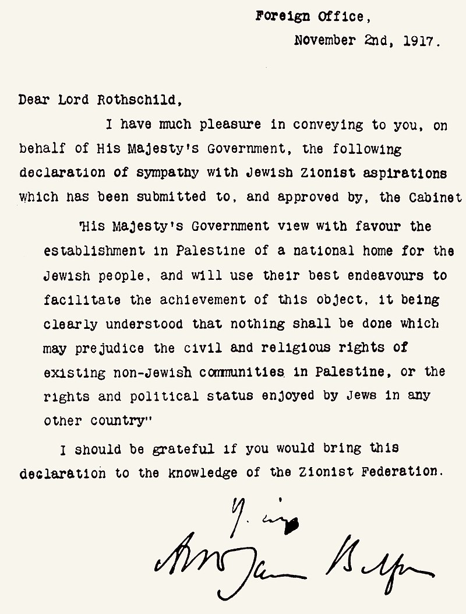

- تعريف ويكيبيديا للوعد

> **وَعْدُ بَلفُور** أو **إعلان بَلفُور** بيانٌ علنيّ أصدرته الحكومة البريطانيّة خلال [الحرب العالمية الأولى](https://ar.wikipedia.org/wiki/%D8%A7%D9%84%D8%AD%D8%B1%D8%A8_%D8%A7%D9%84%D8%B9%D8%A7%D9%84%D9%85%D9%8A%D8%A9_%D8%A7%D9%84%D8%A3%D9%88%D9%84%D9%89 "الحرب العالمية الأولى") لإعلان دعم تأسيس «وطن قوميّ للشعب اليهوديّ» في [فلسطين](https://ar.wikipedia.org/wiki/%D9%81%D9%84%D8%B3%D8%B7%D9%8A%D9%86 "فلسطين")، التي كانت منطقة [عثمانية](https://ar.wikipedia.org/wiki/%D8%A7%D9%84%D8%AF%D9%88%D9%84%D8%A9_%D8%A7%D9%84%D8%B9%D8%AB%D9%85%D8%A7%D9%86%D9%8A%D8%A9 "الدولة العثمانية") ذات أقليّة يهوديّة (حوالي 3-5% من إجماليّ السكان). ونصها (مترجماً إلى العربيّة):
>
 «تنظر حكومة صاحب الجلالة بعين العطف إلى إقامة وطن قوميّ للشعب اليهوديّ في فلسطين، وستبذل غاية جهدها لتسهيل تحقيق هذه الغاية، على أن يفهم جلياً أنه لن يؤتى بعمل من شأنه أن ينتقص من الحقوق المدنية والدينية التي تتمتع بها الطوائف غير اليهودية المقيمة في فلسطين، ولا الحقوق أو الوضع السياسي الذي يتمتع به اليهود في أي بلد آخر.»
,
 ضُمِّنَ هذا الوعد ضمن رسالة بتاريخ 2 نوفمبر/تشرين الثاني عام 1917 مُوَجَّهَةٌ من وزير خارجيّة  المملكة المتحدة [آرثر بلفور](https://ar.wikipedia.org/wiki/%D8%A2%D8%B1%D8%AB%D8%B1_%D8%AC%D9%8A%D9%85%D8%B3_%D8%A8%D9%84%D9%81%D9%88%D8%B1 "آرثر جيمس بلفور") إلى اللورد [ليونيل دي روتشيلد](https://ar.wikipedia.org/wiki/%D9%84%D9%8A%D9%88%D9%86%D9%8A%D9%84_%D9%88%D9%88%D9%84%D8%AA%D8%B1_%D8%AF%D9%8A_%D8%B1%D9%88%D8%AA%D8%B4%D9%8A%D9%84%D8%AF "ليونيل وولتر دي روتشيلد") أحد أبرز أوجه المجتمع اليهودي  البريطاني، وذلك لنقلها إلى [الاتحاد الصهيوني](https://ar.wikipedia.org/wiki/%D8%A7%D9%84%D8%A7%D8%AA%D8%AD%D8%A7%D8%AF_%D8%A7%D9%84%D8%B5%D9%87%D9%8A%D9%88%D9%86%D9%8A "الاتحاد الصهيوني") لبريطانيا العُظمى [وإيرلندا](https://ar.wikipedia.org/wiki/%D8%AC%D9%85%D9%87%D9%88%D8%B1%D9%8A%D8%A9_%D8%A3%D9%8A%D8%B1%D9%84%D9%86%D8%AF%D8%A7 "جمهورية أيرلندا"). نُشر نص الوعد  (أو الإعلان) في الصحافة في 9 نوفمبر/تشرين الثانيّ عام  1917.

- من هو بلفور؟
>**ثر جيمس بلفور** ([بالإنجليزية](https://ar.wikipedia.org/wiki/%D8%A7%D9%84%D9%84%D8%BA%D8%A9_%D8%A7%D9%84%D8%A5%D9%86%D8%AC%D9%84%D9%8A%D8%B2%D9%8A%D8%A9 "اللغة الإنجليزية"): Arthur James Balfour)‏ سياسي بريطاني ([25 يوليو](https://ar.wikipedia.org/wiki/25_%D9%8A%D9%88%D9%84%D9%8A%D9%88 "25 يوليو") [1848](https://ar.wikipedia.org/wiki/1848 "1848")-[19 مارس](https://ar.wikipedia.org/wiki/19_%D9%85%D8%A7%D8%B1%D8%B3 "19 مارس") [1930](https://ar.wikipedia.org/wiki/1930 "1930")). تولى رئاسة الوزارة في [بريطانيا](https://ar.wikipedia.org/wiki/%D8%A7%D9%84%D9%85%D9%85%D9%84%D9%83%D8%A9_%D8%A7%D9%84%D9%85%D8%AA%D8%AD%D8%AF%D8%A9 "المملكة المتحدة") من [11 يوليو](https://ar.wikipedia.org/wiki/11_%D9%8A%D9%88%D9%84%D9%8A%D9%88 "11 يوليو") [1902](https://ar.wikipedia.org/wiki/1902 "1902") إلى [5 ديسمبر](https://ar.wikipedia.org/wiki/5_%D8%AF%D9%8A%D8%B3%D9%85%D8%A8%D8%B1 "5 ديسمبر") [1905](https://ar.wikipedia.org/wiki/1905 "1905"). عمل أيضاً وزيراً للخارجية من 1916 إلى 1919 في حكومة [ديفيد لويد جورج](https://ar.wikipedia.org/wiki/%D8%AF%D9%8A%D9%81%D9%8A%D8%AF_%D9%84%D9%88%D9%8A%D8%AF_%D8%AC%D9%88%D8%B1%D8%AC "ديفيد لويد جورج"). اشتهر بإعطاء [وعد بلفور](https://ar.wikipedia.org/wiki/%D9%88%D8%B9%D8%AF_%D8%A8%D9%84%D9%81%D9%88%D8%B1 "وعد بلفور") الذي نص على دعم بريطانيا لإنشاء وطن قومي لليهود في [فلسطين](https://ar.wikipedia.org/wiki/%D9%81%D9%84%D8%B3%D8%B7%D9%8A%D9%86 "فلسطين").
 >
أصبح بلفور عضوًا في البرلمان في عام 1874، وحقق مكانة بارزة بعد توليه منصب رئيس وزراء أيرلندا، إذ ساهم في الحد من الاضطرابات الزراعية باتخاذ تدابير ضد أصحاب الأراضي الغائبين. عارض الحكم الداخلي الأيرلندي مجادلًا أنه لا يوجد حل وسط بين أن تكون أيرلندا ضمن [المملكة المتحدة](https://ar.wikipedia.org/wiki/%D8%A7%D9%84%D9%85%D9%85%D9%84%D9%83%D8%A9_%D8%A7%D9%84%D9%85%D8%AA%D8%AD%D8%AF%D8%A9 "المملكة المتحدة") أو تصبح مستقلة.

- الوعد باختصار
>**قبل أن تضع الحرب العالمية الأولى أوزارها ويتقاسم المنتصرون فيها تركة الإمبراطورية العثمانية، سارع وزير الخارجية البريطاني أرثر بلفور في 2 نوفمبر/ تشرين الثاني من عام 1917 إلى كتابة رسالة إلى المصرفي البريطاني وأحد زعماء اليهود في بريطانيا البارون روتشيلد، أدت إلى قيام دولة إسرائيل وما تبع ذلك من حروب وأزمات في الشرق الاوسط.**
>[source](https://www.bbc.com/arabic/in-depth-41818759)

- المعاهده

> 
