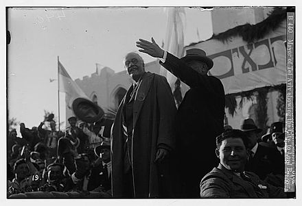

1. 
>   Mark Sykes, a British diplomat, rushed out to share the good news: “Weizmann, it’s a boy!” But the 67-word declaration was vague. It offered a Jewish “homeland”, not a state. Nor did Britain explain how it would be created, promising only “best endeavours” to do so. The Zionist leader’s first reaction was disappointment. The boy “was not the one I had expected,” he later wrote. 
>   [source](https://www.economist.com/middle-east-and-africa/2017/10/26/the-balfour-declaration-still-offers-lessons-to-israel-and-the-palestinians)

2. 
>  Theresa May while celebrating 1 century passed on the balfour declaration said **** Britain would mark its role in the founding of Israel with pride
>  [source](https://www.gov.uk/government/speeches/pm-speech-at-balfour-centenary-dinner)

3. 
   >When the UN voted in 1947 to partition Palestine, the Jews already had the trappings of their state. “What matters is not what the _goyim_ [gentiles](https://www.oxfordlearnersdictionaries.com/definition/english/gentile_1) say, but what the Jews do,” said David Ben-Gurion, the first prime minister of israel. 
   >[source][https://www.economist.com/middle-east-and-africa/2017/10/26/the-balfour-declaration-still-offers-lessons-to-israel-and-the-palestinians]

4. 
  >  وقد ذهب أولاً إلى [الإسكندرية](https://ar.wikipedia.org/wiki/%D8%A7%D9%84%D8%A5%D8%B3%D9%83%D9%86%D8%AF%D8%B1%D9%8A%D8%A9 "الإسكندرية") بعد ظهر الإثنين 23 مارس 1925. وكان في استقباله وفدٌ من المنظمات 
   [الصهيونية](https://ar.wikipedia.org/wiki/%D8%B5%D9%87%D9%8A%D9%88%D9%86%D9%8A%D8%A9 "صهيونية") في [مصر](https://ar.wikipedia.org/wiki/%D9%85%D8%B5%D8%B1 "مصر") وطلاب المدارس اليهودية يرأسهم [حاخام](https://ar.wikipedia.org/wiki/%D8%AD%D8%A7%D8%AE%D8%A7%D9%85 "حاخام")، ولدى وصول السفينة أسپريا الساعة 4 عصراً صعد الحاخام إلى السفينة للترحيب به، وبعد استقبالٍ دام ساعتين -لم يحضره سوى تنظيماتٌ صهيونية- سافر في عربة قطار مجهزة خصيصاً إلى [القاهرة](https://ar.wikipedia.org/wiki/%D8%A7%D9%84%D9%82%D8%A7%D9%87%D8%B1%D8%A9 "القاهرة") حيث نزل ضيفاً على اللورد [اللنبي](https://ar.wikipedia.org/wiki/%D8%A5%D8%AF%D9%85%D9%88%D9%86%D8%AF_%D8%A3%D9%84%D9%86%D8%A8%D9%8A "إدموند ألنبي") وزوجته. في القاهرة قامت مظاهرات عارمة منددة بوصوله كان أكبرها في [حديقة الأزبكية](https://ar.wikipedia.org/wiki/%D8%AD%D8%AF%D9%8A%D9%82%D8%A9_%D8%A7%D9%84%D8%A3%D8%B2%D8%A8%D9%83%D9%8A%D8%A9 "حديقة الأزبكية"). [محمد علي الطاهر](https://ar.wikipedia.org/wiki/%D9%85%D8%AD%D9%85%D8%AF_%D8%B9%D9%84%D9%8A_%D8%A7%D9%84%D8%B7%D8%A7%D9%87%D8%B1) -صاحب جريدة الشورى- الذي كان بين المتظاهرين الرواية التالية:
>
> 	"أمر مدير شرطة الأزبكية ضباطه بسحلي في الشوارع إلى قسم الشرطة بدلاً من نقلي في إحدى عربات >?الشرطة، فجروني إلى القسم في هذاالوضع المهين، والنساء محيطون بي، وقد عاملوا زميلي أمين افندي عبد اللطيف الحسيني -شقيق مفتي القدس- بنفس الطريقة. وفي قسم الشرطة رفض مأمور القسم أن يكتب محضراً ويطلق سراحنا ولا حتى بدفع كفالة، وبدلاً من ذلك صادر أوراقنا الشخصية وسجائرنا واحتجزنا في زنزانة الحجز حتى اليوم التالي."»
> [source](https://ar.wikipedia.org/wiki/%D8%A2%D8%B1%D8%AB%D8%B1_%D8%AC%D9%8A%D9%85%D8%B3_%D8%A8%D9%84%D9%81%D9%88%D8%B1)

5. 
>بقي بلفور عازبًا طيلة فترة حياته. رغبت مارغوت تينانت (مارغوت أسكيث لاحقًا) بالزواج منه، إلا أن بلفور
رفض ذلك وفضّل العمل على بناء مسيرة مهنية خاصة به. حافظت أخته غير المتزوجة، أليس على منزل أسرته. في منتصف عمره، ارتبط بلفور بماري تشارتريس بعلاقة صداقة دامت 40 عاماً، والتي أصبحت كونتيسة ويمز لاحقًا. ذكرت في أحد رسائلها أنه من الصعب تحديد طبيعة صداقتهما، وتشير رسائلها إلى احتمال ارتباطهما بعلاقة عاطفية عام 1887، واحتمال انخراطهما بعلاقة سادية مازوخية. اعتقد كاتب آخر أنهما أقاما علاقة جسدية مباشرة، ورفض الإيحاءات التي استبعدت أن بلفور مثلي الجنس. أثناء حرب بوير، ادعى اللورد بيفيربروك أن بلفور شخص ثلاثي الجنس لم يره أحد عاريًا.

6. 
   >أعجب بلفور بشخصية الزعيم [الصهيوني](https://ar.wikipedia.org/wiki/%D8%B5%D9%87%D9%8A%D9%88%D9%86%D9%8A%D8%A9 "صهيونية") [حاييم وايزمان](https://ar.wikipedia.org/wiki/%D8%AD%D8%A7%D9%8A%D9%8A%D9%85_%D9%88%D8%A7%D9%8A%D8%B2%D9%85%D8%A7%D9%86 "حاييم وايزمان") الذي التقاه عام [1906](https://ar.wikipedia.org/wiki/1906 "1906")، فتعامل مع الصهيونية باعتبارها قوة تستطيع التأثير في [السياسة](https://ar.wikipedia.org/wiki/%D8%B3%D9%8A%D8%A7%D8%B3%D8%A9 "سياسة") الدولية وبالأخص قدرتها على إقناع الرئيس [الأميركي](https://ar.wikipedia.org/wiki/%D8%A7%D9%84%D9%88%D9%84%D8%A7%D9%8A%D8%A7%D8%AA_%D8%A7%D9%84%D9%85%D8%AA%D8%AD%D8%AF%D8%A9 "الولايات المتحدة") [وودرو ويلسون](https://ar.wikipedia.org/wiki/%D9%88%D9%88%D8%AF%D8%B1%D9%88_%D9%88%D9%8A%D9%84%D8%B3%D9%88%D9%86 "وودرو ويلسون") للمشاركة في [الحرب العالمية الأولى](https://ar.wikipedia.org/wiki/%D8%A7%D9%84%D8%AD%D8%B1%D8%A8_%D8%A7%D9%84%D8%B9%D8%A7%D9%84%D9%85%D9%8A%D8%A9_%D8%A7%D9%84%D8%A3%D9%88%D9%84%D9%89 "الحرب العالمية الأولى") إلى جانب بريطانيا. وحين تولى منصب وزارة الخارجية في حكومة [لويد جورج](https://ar.wikipedia.org/wiki/%D8%AF%D9%8A%D9%81%D9%8A%D8%AF_%D9%84%D9%88%D9%8A%D8%AF_%D8%AC%D9%88%D8%B1%D8%AC "ديفيد لويد جورج") في الفترة من كانون الأول/ديسمبر1916 إلى 1919 وعده المعروف بـ«[وعد بلفور](https://ar.wikipedia.org/wiki/%D9%88%D8%B9%D8%AF_%D8%A8%D9%84%D9%81%D9%88%D8%B1 "وعد بلفور")» عام 1917 انطلاقا من تلك الرؤية.

   
7. 
   >غادر قطار بلفور متجهاً إلى فلسطين. وقد عولجت الرحلة ببعض التفصيل في مختلف الدراسات التاريخية، وأبرزها «[الحركة الوطنية الفلسطينية](https://ar.wikipedia.org/wiki/%D8%A7%D9%84%D8%AD%D8%B1%D9%83%D8%A9_%D8%A7%D9%84%D9%88%D8%B7%D9%86%D9%8A%D8%A9_%D8%A7%D9%84%D9%81%D9%84%D8%B3%D8%B7%D9%8A%D9%86%D9%8A%D8%A9 "الحركة الوطنية الفلسطينية") 1917-1936» بقلم عادل غنيم. إلا أن التفصيل الكامل كما سجلته الأهرام يستحق تمحيصاً دقيقاً.

"وبينما كان القطار المقل لبلفور يتقدم نحو فلسطين انهالت رسائل وتلغرافات الاحتجاجات على مكاتب الأهرام. كانت إحداها مرسلة باسم الجالية السورية في مصر وتخاطب بلفور: "نحن ندين إعلانك الجائر، ولن نتخلى عن حقوقنا السليبة وسنواصل نضالنا للنهاية على أمل تحقيق طموحاتنا القومية." وكان التلغراف موقعاً من أكثر من 20 شخصاً -بينهم [شكري القوتلي](https://ar.wikipedia.org/wiki/%D8%B4%D9%83%D8%B1%D9%8A_%D8%A7%D9%84%D9%82%D9%88%D8%AA%D9%84%D9%8A "شكري القوتلي")- الذي سيصبح لاحقاً رئيس [جمهورية سوريا](https://ar.wikipedia.org/wiki/%D8%B3%D9%88%D8%B1%D9%8A%D8%A7 "سوريا"). وتلغراف آخر أرسلته الجالية الأردنية في مصر مذكرةً بلفور بأنه في طريقه إلى "البلد الذي دمر وعدُه المستهجَن حريته" مضيفاً أن وصول بلفور "سيزيد من تمسك الفلسطينيين ببلدهم."

8. 
   > إلا أنه لم تكن الاحتجاجات لتثني بلفور عن طريق المختار. وقد أوفد الأهرام مراسلاً آخر إلى القدس لتغطية تحركات اللورد البريطاني من وقت وصول قطاره إلى المدينة المقدسة. وكانت أولى زيارات بلفور الرسمية هي للمستوطنة الصهيونية "قارا Qara"، حيث استقبل بحفاوةٍ"، وبعد غداءٍ هناك ذهب بلفور وحاشيته إلى [تل أبيب](https://ar.wikipedia.org/wiki/%D8%AA%D9%84_%D8%A3%D8%A8%D9%8A%D8%A8 "تل أبيب") "المدينة اليهودية العصرية المبنية بالقرب من [يافا](https://ar.wikipedia.org/wiki/%D9%8A%D8%A7%D9%81%D8%A7 "يافا")" ولدى وصوله وجد الزائر الكبير "كل البيوت والمعاهد مزينة بالأعلام البريطانية والصهيونية، وحشود من الناس -رجالاً ونساءً وطلاباً- هُرعوا لتحيته حاملين لافتاتٍ عليها صورته على أعناقهم"، ويواصل مراسل الأهرام: "وقد تطوعت قوة من 150 شاباً يهودياً لمساعدة الجيش والشرطة لحفظ النظام."
   >  
>وفي تلك الأثناء أعلنت المدارس في غزة [وطولكرم](https://ar.wikipedia.org/wiki/%D8%B7%D9%88%D9%84%D9%83%D8%B1%D9%85 "طولكرم") وكلية المعلمين في القدس ومعاهد فلسطينية أخرى الإضراب احتجاجاً على زيارة بلفور «كما فعل الناس في جميع أرجاء البلد»، وبلا شك فقد كانت حكومة الانتداب البريطاني في فلسطين مستعدة للاضطرابات المحتملة، فقد أوردت الأهرام أن وزير الحربية البريطاني أعلن في [مجلس العموم](https://ar.wikipedia.org/wiki/%D9%85%D8%AC%D9%84%D8%B3_%D8%B9%D9%85%D9%88%D9%85_%D8%A7%D9%84%D9%85%D9%85%D9%84%D9%83%D8%A9_%D8%A7%D9%84%D9%85%D8%AA%D8%AD%D8%AF%D8%A9 "مجلس عموم المملكة المتحدة") أن فوج فرسانٍ مدرعٍ أُرسل من مصر إلى فلسطين لإخماد أي اضطرابات.
>
وبعد ذلك بفترة وجيزة أوردت الأهرام أن الحكومة المصرية تنوي إرسال [أحمد لطفي السيد](https://ar.wikipedia.org/wiki/%D8%A3%D8%AD%D9%85%D8%AF_%D9%84%D8%B7%D9%81%D9%8A_%D8%A7%D9%84%D8%B3%D9%8A%D8%AF "أحمد لطفي السيد")، مدير [الجامعة المصرية](https://ar.wikipedia.org/wiki/%D8%AC%D8%A7%D9%85%D8%B9%D8%A9_%D8%A7%D9%84%D9%82%D8%A7%D9%87%D8%B1%D8%A9 "جامعة القاهرة")، إلى فلسطين لحضور حفل افتتاح الجامعة العبرية. وقد فوجئ العديد بالرغم من صيحاsت الفلسطينيين في مصر أن البروفسور وافق على الذهاب. وفي رسالة إلى الأهرام احتج الشباب العربي بفلسطين على قبول أحمد لطفي السيد للدعوة لكونها طعنة في ظهر فلسطين العربية وناشدوا الحكومة المصرية أن تغير قرارها. وبشكلٍ مماثلٍ أعرب الطلاب الفلسطينيون في جامعة الأزهر عن حزنهم لقرار الجامعة إرسال وفد إلى الافتتاح لأنه «سوف يمكّن الصهاينة من استخدام اسم مصر لصالحهم». ومرة أخرى سقطت الاحتجاجات الفلسطينية على آذانٍ صماء، إذ ذهب مدير الجامعة المصرية إلى فلسطين لحضور افتتاح [الجامعة العبرية في القدس](https://ar.wikipedia.org/wiki/%D8%A7%D9%84%D8%AC%D8%A7%D9%85%D8%B9%D8%A9_%D8%A7%D9%84%D8%B9%D8%A8%D8%B1%D9%8A%D8%A9_%D9%81%D9%8A_%D8%A7%D9%84%D9%82%D8%AF%D8%B3 "الجامعة العبرية في القدس")، وهو الفعل الذي أبدى ندمه عليه لاحقاً.

9. 
   >قال إنه تعهد بإنشاء وطن قومي لليهود في فلسطين، وإنها ليست خطة شخص واحد أو أمة، بل هو تجسيدٌ لرأي هيئة أكبر الدول التي وقعت على [معاهدة فرساي](https://ar.wikipedia.org/wiki/%D9%85%D8%B9%D8%A7%D9%87%D8%AF%D8%A9_%D9%81%D8%B1%D8%B3%D8%A7%D9%8A)

10. 
>المرحلة التالية من جولة بلفور أخذته إلى سوريا حيث سيقابل موقفاً مختلفاً تماماً. فسوريا لم تكن خاضعة لحكم الانتداب البريطاني المستعد دوماً لقمع مظاهرات الفلسطينيين، وسيتعرض للطرد، وكان في ذلك العام أن سوريا تستعد للثورة السورية الكبرى التي بدأت في وقتٍ لاحقٍ من نفس العام، وهنالك لن يوجد أي صهيوني لاستقبال بلفور.>

11. 
>المرحلة التالية من جولة بلفور أخذته إلى سوريا حيث سيقابل موقفاً مختلفاً تماماً. فسوريا لم تكن خاضعة لحكم الانتداب البريطاني المستعد دوماً لقمع مظاهرات الفلسطينيين، وسيتعرض للطرد، وكان في ذلك العام أن سوريا تستعد للثورة السورية الكبرى التي بدأت في وقتٍ لاحقٍ من نفس العام، وهنالك لن يوجد أي صهيوني لاستقبال بلفور.
>
وفي صباح 8 إبريل تم تعيين حراسةٍ مشددّةٍ على القطار الذي سينقل بلفور والوفد المرافق له من حيفا إلى دمشق واصطحب بلفور معه مسؤولين حكوميين وعملاء بريطانيين أرسلوا لضمان سلامته، ورغم أن الحكومة البريطانية مركزت الشرطة في المحطات لكن هذا لم يمنع القرويين من أن يحتجوا ويرفعوا لوحات سوداء أثناء مرور القطار.
>
كما أمـَّنت السلطات البريطانية اتفاقية من حكومة المحمية الفرنسية في سوريا لحماية بلفور أثناء زيارته. ولذلك أمـَّنت السلطات الفرنسية في حوران ودرعا محطات السكة الحديد في تلك المناطق وقد ذهب القائد الفرنسي لشرطة دمشق إلى الحدود لتحية القطار. ويواصل الأهرام تقريره «وعندما وصل القطار إلى درعا كان المسؤولون الفرنسيون مصطفين لاستقبال بلفور ودعوه وحاشيته إلى وجبة في مطعم المحطة، التي منع قومندان الشرطة دخول الناس إليها، وبعدها عاد بلفور للقطار في طريقه لدمشق».